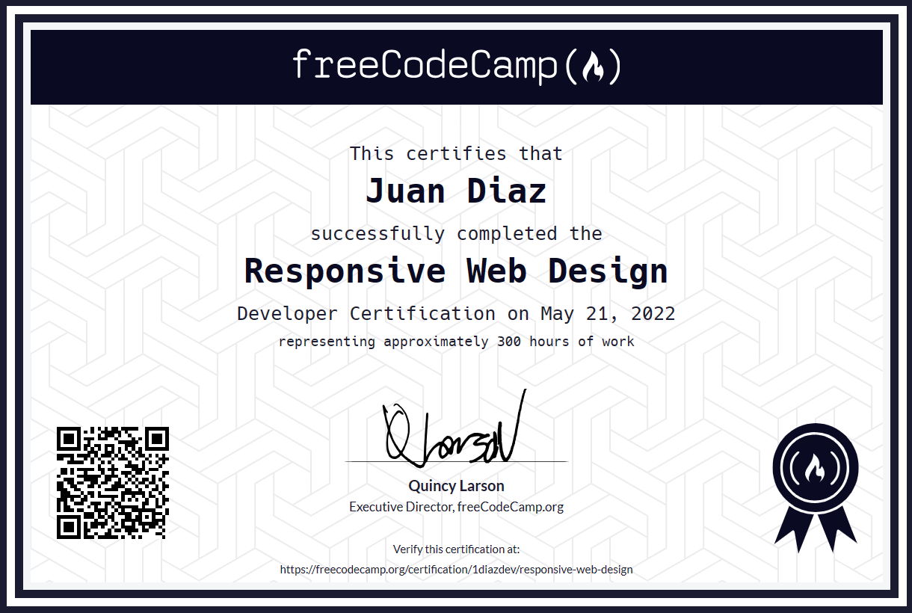
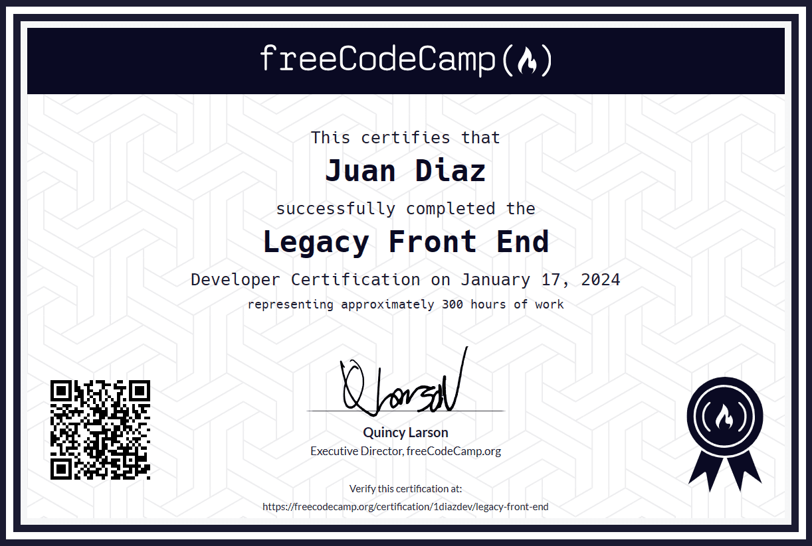
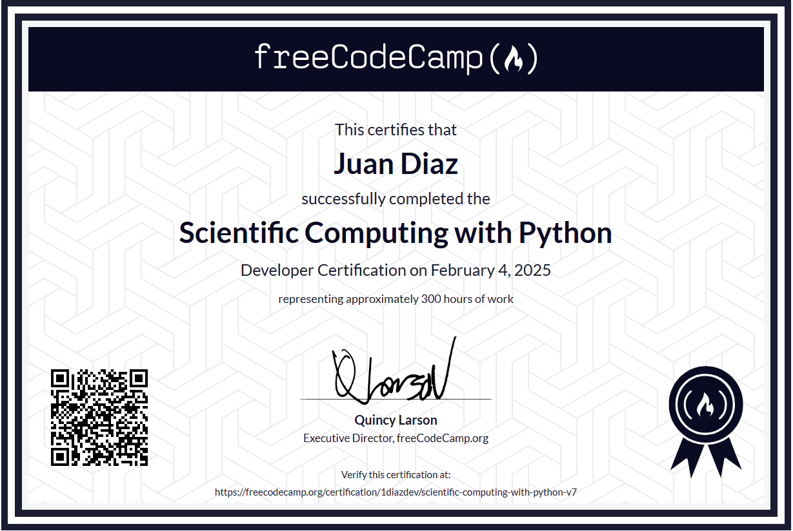

# FreeCodeCamp Certification Projects

This repository contains all the projects completed to earn freeCodeCamp certifications. Each folder corresponds to a specific certification and includes a link to the related project repos.

## Certifications

|                                                                                                                                               |                                                                                                                                                                                 |
| --------------------------------------------------------------------------------------------------------------------------------------------- | ------------------------------------------------------------------------------------------------------------------------------------------------------------------------------- |
|  |                        |
|                 |  |

---

### Responsive Web Design 

 <!-- | [Certified in 2022](https://www.freecodecamp.org/certification/1diazdev/responsive-web-design) -->

- [Build a Survey Form](https://codepen.io/1diazdev/pen/KLNpgw)
- [Build a Tribute Page](https://codepen.io/1diazdev/pen/wJWJEZ?editors=1000)
- [Build a Technical Documentation Page](https://github.com/JuanPabloDiaz/doc) ⚡ [Demo](https://docs.jpdiaz.dev)
- [Build a Product Landing Page](https://github.com/JuanPabloDiaz/landingZone) ⚡ [Demo](https://lp.jpdiaz.dev)
- [Build a Personal Portfolio Webpage](https://github.com/JuanPabloDiaz/jpdiaz) ⚡ [Demo](https://jpdiaz.dev)

### Front End Development Libraries

 <!-- | [Certified in 2023](https://www.freecodecamp.org/certification/1diazdev/front-end-development-libraries) -->

> **Note:** You can also visit my _[FreeCodeCamp Collection (freecodecamp.jpdiaz.dev)](https://freecodecamp.jpdiaz.dev)_ website, it is a non official site that I build to consolidate all the projects below in a single site instead of using multiple sites and repos.

- [Build a Random Quote Machine](https://github.com/JuanPabloDiaz/random-quote-generator) ⚡ [Demo](https://quote.jpdiaz.dev). | Or visit `freecodecamp.jpdiaz.dev/Quote`
- [Build a Markdown Previewer](https://github.com/JuanPabloDiaz/markdownPreviewer) ⚡ [Demo](https://markdown.jpdiaz.dev). | Or visit `freecodecamp.jpdiaz.dev/Markdown`
- [Build a Drum Machine](https://github.com/JuanPabloDiaz/drumMachine) ⚡ [Demo](https://drum.jpdiaz.dev). | Or visit `freecodecamp.jpdiaz.dev/Drum)`
- [Build a JavaScript Calculator](https://github.com/JuanPabloDiaz/calculator) ⚡ [Demo](https://math.jpdiaz.dev). | Or visit `freecodecamp.jpdiaz.dev/calculator`
- [Build a 25 + 5 Clock](https://github.com/JuanPabloDiaz/25-5_clock) ⚡ [Demo](https://25.jpdiaz.dev) | Or visit `freecodecamp.jpdiaz.dev/Pomodoro`

### Legacy Front End

 <!-- | [Certified in 2024](https://www.freecodecamp.org/certification/1diazdev/legacy-front-end) -->

> **Note:** You can also visit my _[FreeCodeCamp Collection (freecodecamp.jpdiaz.dev)](https://freecodecamp.jpdiaz.dev)_ website, it is a non official site that I build to consolidate all the projects below in a single site instead of using multiple sites and repos.

- [Build a Personal Portfolio Webpage](https://github.com/JuanPabloDiaz/freecodecamp) ⚡ [Demo](https://freecodecamp.jpdiaz.dev) ⚡ [Demo](https://codepen.io/1diazdev/pen/EzNaQV)
- [Build a Random Quote Machine](https://github.com/JuanPabloDiaz/random-quote-generator) ⚡ [Demo](https://quote.jpdiaz.dev). | Or visit `freecodecamp.jpdiaz.dev/Quote`
- [Build a 25 + 5 Clock](https://github.com/JuanPabloDiaz/25-5_clock) ⚡ [Demo](https://25.jpdiaz.dev) | Or visit `freecodecamp.jpdiaz.dev/Pomodoro`
- [Build a JavaScript Calculator](https://github.com/JuanPabloDiaz/calculator) ⚡ [Demo](https://math.jpdiaz.dev). | Or visit `freecodecamp.jpdiaz.dev/calculator`
- [Show the Local Weather](https://github.com/JuanPabloDiaz/weather) ⚡ [Demo](https://weather.jpdiaz.dev) | Or visit `freecodecamp.jpdiaz.dev/Weather`
- [Use the TwitchTV JSON API](https://github.com/JuanPabloDiaz/twitch) ⚡ [Demo](https://twitch.jpdiaz.dev) | Or visit `freecodecamp.jpdiaz.dev/Twitch`
- [Build a Wikipedia Viewer](https://github.com/JuanPabloDiaz/wikipediaViewer) ⚡ [Demo](https://wiki.jpdiaz.dev) | Or visit `freecodecamp.jpdiaz.dev/Wikipedia`
- [Build a Tic Tac Toe Game](https://github.com/JuanPabloDiaz/ticTacToe) ⚡ [Demo](https://tictactoe.jpdiaz.dev) | Or visit `freecodecamp.jpdiaz.dev/TicTacToe`
- [Build a Simon Game](https://github.com/JuanPabloDiaz/simonGame) ⚡ [Demo](https://simon.jpdiaz.dev) | Or visit `freecodecamp.jpdiaz.dev/Simon`
- [Build a Tribute Page ](https://codepen.io/1diazdev/pen/wJWJEZ?editors=1000)

### Scientific Computing with Python

 <!-- | [Certified in 2025](https://www.freecodecamp.org/certification/1diazdev/scientific-computing-with-python-v7) -->

- [Arithmetic Formatter](./ScientificComputingWithPython/ArithmeticFormatter)
- [Time Calculator](./ScientificComputingWithPython/TimeCalculator)
- [Budget App](./ScientificComputingWithPython/BudgetApp)
- [Polygon Area Calculator](./ScientificComputingwithPython/PolygonAreaCalculator)
- [Probability Calculator](./ScientificComputingWithPython/ProbabilityCalculator)

### JavaScript Algorithms and Data Structures

- [Build a Palindrome Checker](./JavaScriptAlgorithmsAndDataStructures/PalindromeChecker)
- [Build a Roman Numeral Converter](./JavaScriptAlgorithmsAndDataStructures/RomanNumeralConverter)
- [Build a Telephone Number Validator](./JavaScriptAlgorithmsAndDataStructures/TelephoneNumberValidator)
- [Build a Cash Register](./JavaScriptAlgorithmsAndDataStructures/CashRegister)
- [Build a Pokémon Search App](./JavaScriptAlgorithmsAndDataStructures/PokemonSearchApp)

### Legacy JavaScript Algorithms and Data Structures

- [Build a Palindrome Checker](./LegacyJavaScriptAlgorithmsAndDataStructures/PalindromeChecker)
- [Build a Roman Numeral Converter](./LegacyJavaScriptAlgorithmsAndDataStructures/RomanNumeralConverter)
- [Build a Caesars Cipher](./LegacyJavaScriptAlgorithmsAndDataStructures/CaesarsCipher)
- [Build a Telephone Number Validator](./LegacyJavaScriptAlgorithmsAndDataStructures/TelephoneNumberValidator)
- [Build a Cash Register](./LegacyJavaScriptAlgorithmsAndDataStructures/CashRegister)

<!-- ### Data Analysis with Python
- [Mean-Variance-Standard Deviation Calculator](./DataAnalysiswithPython)
- [Demo graphic Data Analyzer](./DataAnalysiswithPython)
- [Medical Data Visualizer](./DataAnalysiswithPython)
- [Page View Time Series Visualizer](./DataAnalysiswithPython)
- [Sea Level Predictor](./DataAnalysiswithPython) -->

<!-- ### Machine Learning with Python
- [Rock Paper Scissors](./MachineLearningwithPython)
- [Cat and Dog Image Classifier](./MachineLearningwithPython)
- [Book Recommendation Engine using KNN](./MachineLearningwithPython)
- [Linear Regression Health Costs Calculator](./MachineLearningwithPython)
- [Neural Network SMS Text Classifier](./MachineLearningwithPython) -->

(<a href="#top">👆 Top 👆</a>)

